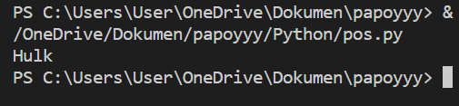

# praktikum5

## 1. Buat sebuah list sebanyak 5 elemen dengan nilai bebas

### output

  
## - Tampilkan elemen ke 3

### Untuk menampilkan elemment ke tiga menggunakan print(list[2]) dimana "[2]" adalah index dari element ketiga  

### output

## - Ambil nilai elemen ke 2 sampai elemen ke 4

### Untuk menampilkan elemment kedua sampai ke empat menggunakan print(list[1:4]) dimana "[1:4]" adalah index dari element kedua sampai keempat 

output

 
## - Ambil elemen terakhir
### Untuk menampilkan elemment terakhir menggunakan print(list[4]) dimana "[4]" adalah index dari element terakhir

### output

 
## 2. Ubah elemen list
## - Ubah elemen ke 4 dengan nilai lainnya
 ### Untuk mengubah element ke 4 didalam list, menggunakan namavariable [3]= "element baru" artinya kita ingin mengubah index 3 dengan nilai yang baru.

### output

 
## - Ubah elemen ke 4 sampai dengan elemen terakhir
Untuk mengubah element ke 4 sampai dengan terakhir, menggunakan namavariable [3:]= "element1, element2" artinya kita ingin mengubah index 3 sampai terakhir dengan nilai yang baru.  

### output

 

 
